

  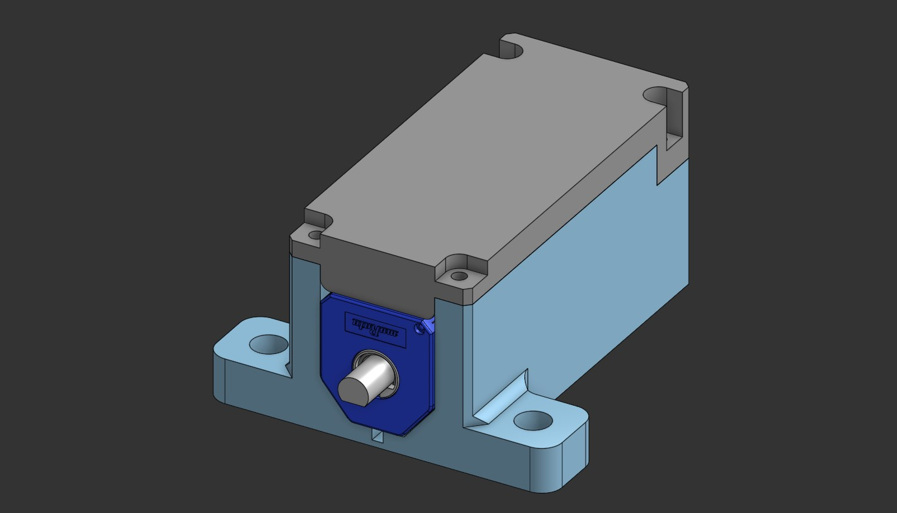
  <h1>N20 Servo</h1>
  
<strong>A CH32V003-powered small size closed-loop actuator</strong>

  
  

    
    
    
    
  

<h2>Table of Contents</h2>
<ul>
  <li><a href="#introduction">1. Introduction</a></li>
  <li><a href="#credits">2. Credits</a></li>
  <li><a href="#technical-specs">3. Technical Specifications</a></li>
  <li><a href="#pcb-and-hardware-revisions">4. PCB & Hardware Revisions</a></li>
  <li><a href="#cad-and-mechanical-design">5. CAD & Mechanical Design</a></li>
  <li><a href="#firmware-and-platformio-environments">6. Firmware & PlatformIO Environments</a></li>
  <li><a href="#additional-tools">7. Additional Tools</a></li>
  <li><a href="#changelog">8. Changelog</a></li>
</ul>

<h2 id="introduction">1. Introduction</h2>

  The <strong>N20 Servo</strong> is an affordable, high-performance(?) closed-loop actuator system built around the WCH CH32V003 RISC-V 32-bit microcontroller. The project was created from my dissatisfaction of the SG90 servo performance: lots of backlash and weak torque, and the failed attempt when trying and modify the servo with the DIY solution (link in Credits) but found it rather hard to properly install the very thin metal wiper and secure the potentiometer body onto the metal surface of the motor. Therefore, I set my goal on creating a better alternative.

  This project contains the firmware, CAD assemblies, PCB views, and debugging utilities required to build, test, and tune.
   
  If there's anything wrong, you can raise an issue and let me know. Thank you for your help.

<h2 id="credits">2. Credits</h2>

  This project is designed, developed, and maintained by: imdolce (aka dolce_st, hovietkien49).

> [!IMPORTANT]
> Code base development is assisted by OpenAI Codex. On my side, I try to read and comprehend the functions used on this chip or the whole CH32 family in general, as it is my first time working with this chip.

  Other sources and ideas:

<ul>
<li>DIY Servo Modding Guide: <a href="https://www.youtube.com/watch?v=6JWuUFiOJBk">How to convert an N20 gear motor into a servo using SG90 parts</a> — by JANIUL HAQ</li>

<li>Angle Sensor Adapter: <a href="https://github.com/jkugalde/N20-Servo-Module">N20-Servo-Module (3D print + N20 motor + angle sensor = servo motor)</a> — by jkugalde</li>

<li>N20 DC Motor CAD Model: <a href="https://grabcad.com/library/n20-dc-gear-motor-1">N20 DC Gear Motor | GrabCAD Library</a> — by RamBros 3D</li>

<li>SG90 CAD Model: <a href="https://grabcad.com/library/sg90-micro-servo-9g-tower-pro-1">SG90 Micro Servo 9g | GrabCAD Library</a> — by Mattheus Frasson</li>

</ul>

<h2 id="technical-specs">3. Technical Specifications</h2>

The following table outlines the hardware and software specifications of the N20 Servo:

<table border="1" cellpadding="8" cellspacing="0" style="border-collapse: collapse; width: 100%; border-color: #ddd;">
  <thead>
    <tr style="background-color: #f2f2f2;">
      <th align="left">Parameter</th>
      <th align="left">Specification</th>
      <th align="left">Notes</th>
    </tr>
  </thead>
  <tbody>
    <tr>
      <td><strong>Microcontroller</strong></td>
      <td>WCH CH32V003J4M6 (RISC-V 32-bit Core @ 48 MHz)</td>
      <td>Dirt cheap 5 cents MCU.</td>
    </tr>
    <tr>
      <td><strong>Operating voltage</strong></td>
      <td>5V</td>
      <td>Shared power bus with motor driver.</td>
    </tr>
    <tr>
      <td><strong>Actuator</strong></td>
      <td>N20 Geared DC Motor</td>
      <td>High torque, compact size.</td>
    </tr>
    <tr>
      <td><strong>H-bridge chip</strong></td>
      <td>RZ78xx, SA8301, DRV8210, DRV8837</td>
      <td>RZ78xx driver series include: RZ7888, RZ7889, RZ7899. Currently the RZ7888 and SA8301 are used because it's cheap.</td>
    </tr>
    <tr>
      <td><strong>H-Bridge Output</strong></td>
      <td>Dual-PWM control on <code>PC1</code> and <code>PC2</code></td>
      <td>Drives motor direction and speed using TIM2.</td>
    </tr>
    <tr>
      <td><strong>PWM Frequency</strong></td>
      <td>2.0 kHz</td>
      <td>Adjustable via <code>MOTOR_PWM_HZ</code> in config.</td>
    </tr>
    <tr>
      <td><strong>Position Feedback</strong></td>
      <td>SV01A103AEA01R00 10K (or similar clones) angle position detector (Wiper input pin <code>PA2</code>)</td>
      <td>Read via ADC1 Channel 0, 10-bit resolution..</td>
    </tr>
    <tr>
      <td><strong>Traverse range</strong></td>
      <td>Up to 330° (-165° to +165° symmetrical) mechanical travel</td>
      <td>To make the servo safely accomodate within the wiper track of the angle detector, the traverse angle is limited to 320° (-160° to +160° symmetrical).</td>
    </tr>
    <tr>
      <td><strong>Input Signal</strong></td>
      <td>50 Hz RC Servo PWM, <code>PC4</code></td>
      <td>Captured via TIM1 Channel 4 (1000µs to 2000µs, 0° angle at 1500µs).</td>
    </tr>
    <tr>
      <td><strong>Polling rate</strong></td>
      <td>500 Hz (2 ms)</td>
      <td>Position feedback and control loop.</td>
    </tr>
    <tr>
      <td><strong>Telemetry UART</strong></td>
      <td>921600 baud on <code>PD5</code> (UART1 Remap 2 TX)</td>
      <td>CSV telemetry output for live tuning.</td>
    </tr>
  </tbody>
</table>

<h2 id="pcb-and-hardware-revisions">4. PCB & Hardware Revisions</h2>

> [!TIP]
> You can view & get the PCB schematic and designs in this repository, or visit my post on OSHWLAB (coming soon).

> [!IMPORTANT]
> It is not recommended to order PCB of the initial version <code>1D2 (1Д2)</code>, as it requires good soldering skill to install components on both sides and wiring up the angle detector with bodge wires. The <code>1D3 (1Д3)</code> version aims to resolve both issues. More details will be added as soon as I can get my hands on the new <code>1Д3</code> PCB. 

<h3> 1. Initial version  <code>1D2 (1Д2)</code></h3>

The electronics are designed to fit directly on top of the N20 motor. The enclosure is designed specifically for the first revision <code>1Д2</code> 

<table border="1" cellpadding="8" cellspacing="0" style="border-collapse: collapse; width: 100%; border-color: #ddd;">
  <thead>
    <tr style="background-color: #f2f2f2;">
      <th align="left" style="width: 25%;">View</th>
      <th align="center" style="width: 45%;">Imagew</th>
      <th align="left" style="width: 30%;">Description</th>
    </tr>
  </thead>
  <tbody>
    <tr>
      <td><strong>PCB View</strong></td>
      <td align="center">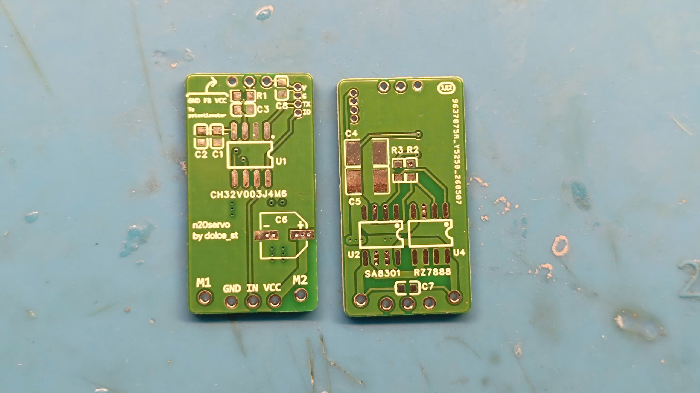</td>
      <td>Bare PCB appearance, top and bottom view.</td>
    </tr>
    <tr>
      <td><strong>Top populated view</strong></td>
      <td align="center">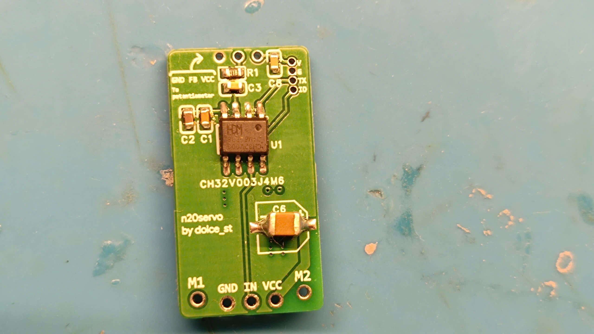</td>
      <td>Fully populated top view of the PCB.</td>
    </tr>
    <tr>
      <td><strong>Bottom populated view</strong></td>
      <td align="center">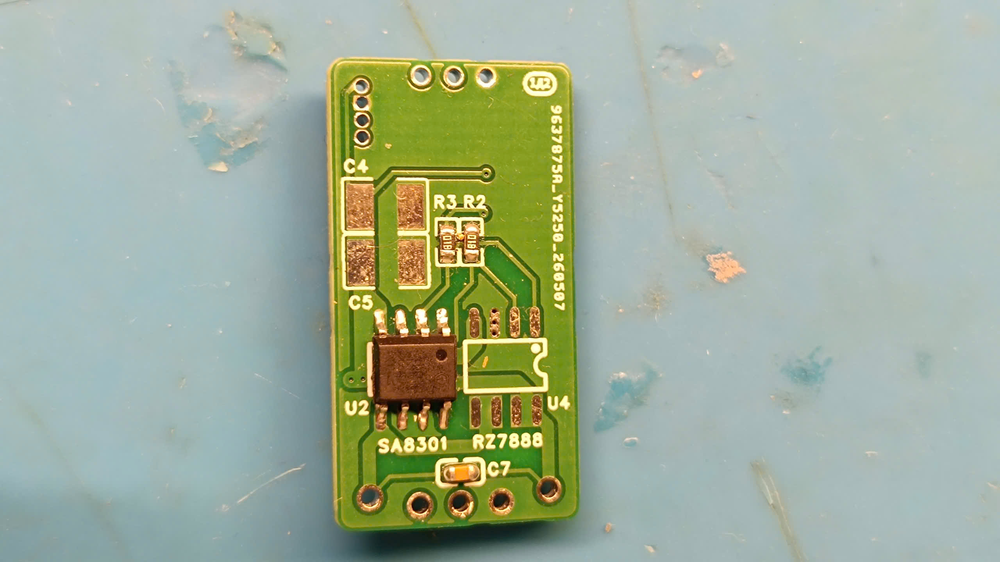</td>
      <td>Partially populated bottom view of the PCB, bottom 2 22uF capacitors are removed due to their interference with the motor below. </td>
    </tr>
    <tr>
      <td><strong>Angle sensor and adapter collet</strong></td>
      <td align="center">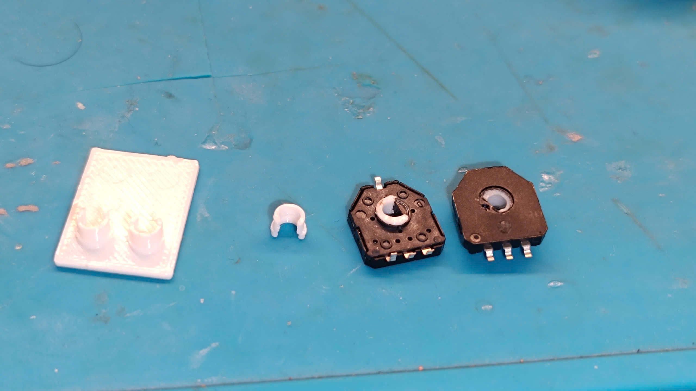</td>
      <td>Top and bottom view of the angle sensor, with the adapter collet installed, the standalone collet (second to the left side) the 3D printed custom fixture to easily print the adapter collets (white rectangle on the left side)</td>
    </tr>
    <tr>
      <td><strong>Test setup</strong></td>
      <td align="center">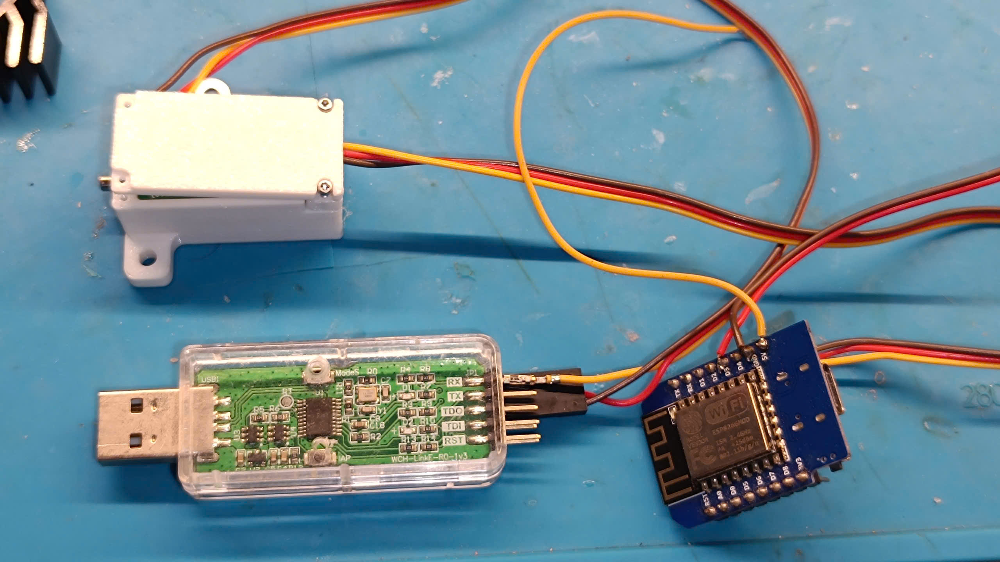</td>
      <td>Consists of: Partially assembled N20 Servo assembly (to make space for the Outcoming UART TX telemetry), WEMOS D1 Mini for PWM output, WCH-LinkE for UART telemtry reading and MCU programming.</td>
    </tr>
  </tbody>
</table>

<h3> 2. Second version  <code>1D3 (1Д3)</code></h3>

 In this new version, it aims to resolve the difficulty of populating the PCB and wiring the angle detector. Currently I have not tested the design myself, so documentation is limited. There are 5 different PCB designs, <code>1Д3-1/2/3/4</code> incorporates 4 different designs of 4 different motor drivers, it was made to avoid ordering multiple PCB revisions. The remaining 4 designs <code>1Д3-1</code>, <code>1Д3-2</code>, <code>1Д3-3</code>, <code>1Д3-4</code> are standalone boards, using the <code>SA8301</code>, <code>RZ7888</code>, <code>DRV8210DRLR</code>, <code>DRV8837DSGR</code> respectively to each design.
 

<table border="1" cellpadding="8" cellspacing="0" style="border-collapse: collapse; width: 100%; border-color: #ddd;">
  <thead>
    <tr style="background-color: #f2f2f2;">
      <th align="left" style="width: 25%;">View</th>
      <th align="center" style="width: 45%;">Image</th>
      <th align="left" style="width: 30%;">Description</th>
    </tr>
  </thead>
  <tbody>
    <tr>
      <td><strong>PCB View</strong></td>
      <td align="center"></td>
      <td>Coming soon.</td>
    </tr>
    <tr>
      <td><strong>Top populated view</strong></td>
      <td align="center"></td>
      <td>Coming soon.</td>
    </tr>
    <tr>
      <td><strong>Bottom populated view</strong></td>
      <td align="center"></td>
      <td>Coming soon.</td>
    </tr>
  </tbody>
</table>

<h2 id="cad-and-mechanical-design">5. CAD & Mechanical Design</h2>

  The enclosure is designed using Onshape. The link is included here: <a href="https://cad.onshape.com/documents/3d875b828e8759d6e6ceaa1a/w/557cd3ef9bc182fa57785d1d/e/bd1feb28422a2b0780a86111">CAD Design </a>

> [!IMPORTANT]
> Use 4x M1.4x6 Self-tap SHCS and a 1.3mm Allen key or T4 Torx screwdriver bit to close and secure the top cover. The same screw size will persist across all future releases.

  <table border="0" cellpadding="4" cellspacing="0" style="border-collapse: collapse; margin: auto;">
    <tr>
      <td align="center" style="padding: 10px;">
        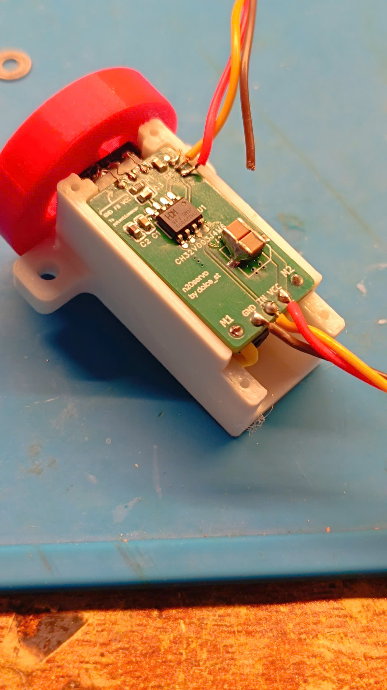 
        <em>Isometric View</em>
      </td>
      <td align="center" style="padding: 10px;">
        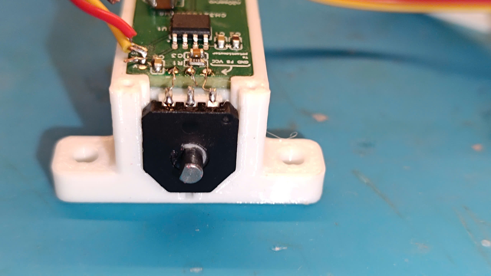 
        <em>Front View</em>
      </td>
    </tr>
    <tr>
      <td align="center" style="padding: 10px;">
        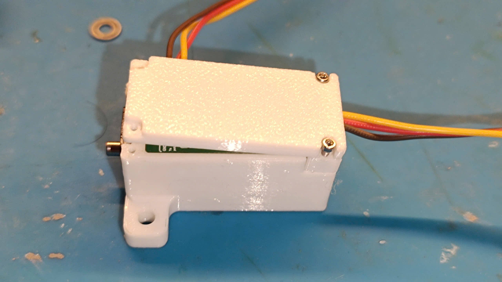 
        <em>Side View</em>
      </td>
      <td align="center" style="padding: 10px;">
        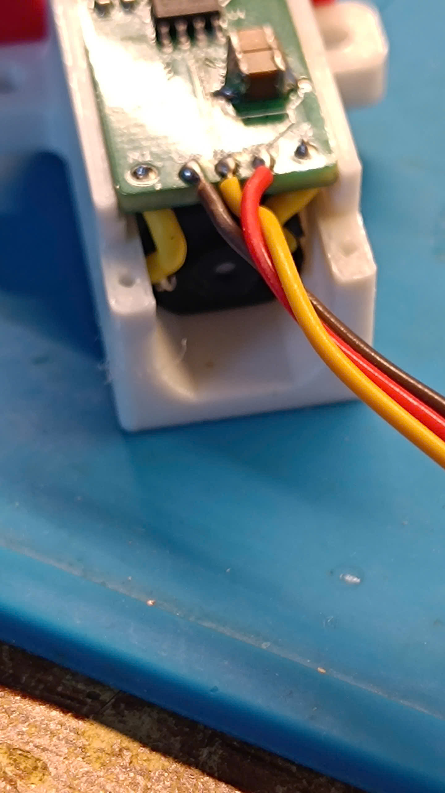 
        <em>Rear View</em>
      </td>
    </tr>
    <tr>
      <td align="center" colspan="2" style="padding: 10px;">
        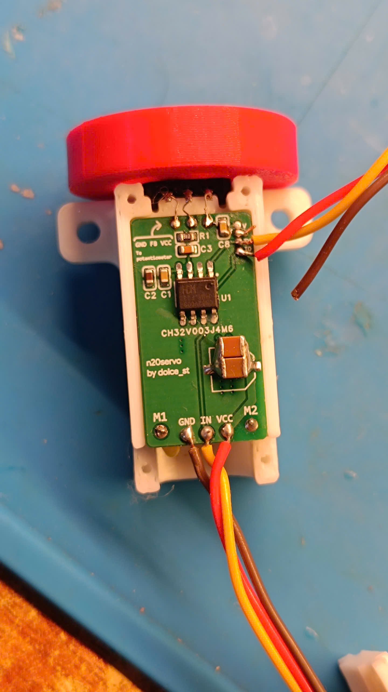 
        <em>Top Down View</em>
      </td>
    </tr>
  </table>

<h2 id="firmware-and-platformio-environments">6. Firmware & PlatformIO Environments</h2>

  The firmware is written in C, using WCH Standard Peripheral Library (StdPeriphLib) <code>aka noneos-sdk</code>. The project is managed using <a href="https://platformio.org/">PlatformIO</a>.

<h3>Build & Uploading</h3>

To compile and upload the default firmware environment using a WCH-LinkE programmer, run:

<pre><code>platformio run -e genericCH32V003J4M6_servo_control -t upload</code></pre>

Or click the Upload button

<h3>PlatformIO Environments</h3>

The environment for this project is defined in <code>platformio.ini</code>:

<table border="1" cellpadding="8" cellspacing="0" style="border-collapse: collapse; width: 100%; border-color: #ddd;">
  <thead>
    <tr style="background-color: #f2f2f2;">
      <th align="left">Environment Name</th>
      <th align="left">Description</th>
      <th align="left">Build Configurations</th>
    </tr>
  </thead>
  <tbody>
    <tr>
      <td><code>genericCH32V003J4M6_servo_control</code></td>
      <td><strong>Production Closed-Loop Servo</strong>: Primary operational environment. Telemetry output is disabled to prevent UART TX blocks and ensure minimum control loop jitter.</td>
      <td><code>TEST_MODE_SERVO_CONTROL</code> <code>SERVO_CONTROL_TELEMETRY_ENABLE=0</code></td>
    </tr>
    <tr>
      <td><code>genericCH32V003J4M6_servo_control_debug</code></td>
      <td><strong>Debug Closed-Loop Servo</strong>: Enables high-speed CSV telemetry output via UART for visualization and tuning.</td>
      <td><code>TEST_MODE_SERVO_CONTROL</code> <code>SERVO_CONTROL_TELEMETRY_ENABLE=1</code></td>
    </tr>
    <tr>
      <td><code>genericCH32V003J4M6</code></td>
      <td><strong>Motor Sweep Test</strong>: Periodically drives the motor from limit to limit. Useful for verifying gear engagement, mechanical tolerances, and limits.</td>
      <td><code>TEST_MODE_MOTOR_SWEEP</code></td>
    </tr>
    <tr>
      <td><code>genericCH32V003J4M6_adc_only</code></td>
      <td><strong>ADC Calibrator</strong>: Reads the position potentiometer raw values and displays computed angles. Essential for finding <code>POT_ADC_AT_NEG160</code> and <code>POT_ADC_AT_POS160</code> parameters.</td>
      <td><code>TEST_MODE_ADC_ONLY</code></td>
    </tr>
    <tr>
      <td><code>genericCH32V003J4M6_rc_input_capture</code></td>
      <td><strong>PWM Signal Capture Monitor</strong>: Measures the pulse width and period of incoming RC PWM signals without driving the motor. Used for verifying receiver compatibility.</td>
      <td><code>TEST_MODE_RC_INPUT_CAPTURE</code></td>
    </tr>
  </tbody>
</table>

<h2 id="additional-tools">7. Additional Tools</h2>

  To facilitate tuning and development, the project includes desktop tools located in the <code>tools/</code> folder. Precompiled executables are included alongside their source Python implementations.
  Refer to <a href="tools/README.md">Tools guide</a>

<h3>1. Serial Dashboard</h3>
<ul>
  <li><strong>File:</strong> <code>tools/python/serial_dashboard.py</code> (Executable: <code>tools/serial_dashboard.exe</code>)</li>
  <li><strong>Description:</strong> Reads the high-speed UART telemetry stream and plots real-time curves showing command target vs. measured position, error metrics, motor duty cycle, and signal validity.</li>
  <li><strong>Usage:</strong>
    <pre><code>python tools/python/serial_dashboard.py --port COM5 --baud 921600</code></pre>
  </li>
  <li><strong>Test / Demo Modes:</strong>
    (This will be removed in the next release).
    <pre><code>python tools/python/serial_dashboard.py --demo --demo-mode servo
python tools/python/serial_dashboard.py --self-test</code></pre>
    Or use the included executeable.
  </li>
</ul>

<h3>2. Servo Configurator</h3>
<ul>
  <li><strong>File:</strong> <code>tools/python/servo_configurator.py</code> (Executable: <code>tools/servo_configurator.exe</code>)</li>
  <li><strong>Description:</strong> A graphical user interface using Tkinter for inspecting and editing the configuration header <code>include/servo_config.h</code>. It automatically checks configuration boundaries, performs self-tests, and saves a timestamped backup before modifying the file.</li>
  <li><strong>Usage:</strong>
    <pre><code>python tools/python/servo_configurator.py</code></pre>
    Or use the included executeable.
  </li>
</ul>

<h2 id="changelog">8. Changelog</h2>
<ul>
  <li><strong>v1.1.0</strong>: Added precompiled executable for <code>serial_dashboard.py</code> and <code>servo_configurator.py</code>, released new PCB version <code>1Д3-1/2/3/4</code> and its standalone variants.</li>
  <li><strong>v1.0.0</strong>: Initial release, no documentation available..</li>
</ul>
